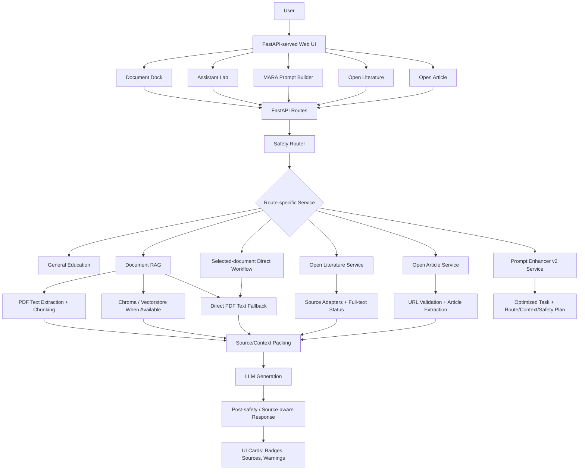

# MARA

**MARA** is the **Medical Agent RAG Assistant**: a FastAPI-based Generative AI medical education system for uploaded medical PDFs, source-grounded study workflows, open literature discovery, public article analysis, and prompt/context planning.

MARA is **educational only**. It is not a diagnosis, dosage, emergency triage, personalized treatment, or clinical decision-support system.

The `ahmed/mara-genai-upgrade` branch is the `v2.0` release candidate. It keeps the original FastAPI backend, web UI at `/`, Swagger at `/docs`, Chroma-based document RAG, PubMed workflows, URL import compatibility, and prompt endpoints while adding safer routing, stronger RAG infrastructure, Open Literature, Open Article, and MARA Prompt Builder.

## Quickstart

### Windows

```powershell
git clone https://github.com/ahmedMnakbi/MedAgentic-RAG-Assistant.git
cd MedAgentic-RAG-Assistant
python start_local.py
```

If Windows opens the Microsoft Store when you type `python`, use:

```powershell
py start_local.py
```

### macOS/Linux

```bash
git clone https://github.com/ahmedMnakbi/MedAgentic-RAG-Assistant.git
cd MedAgentic-RAG-Assistant
python3 start_local.py
```

The launcher creates `.venv`, installs `requirements.txt`, copies `.env.example` to `.env` if needed, creates local storage folders, and starts FastAPI on `127.0.0.1:8000`.

Useful URLs:

- App: [http://127.0.0.1:8000/](http://127.0.0.1:8000/)
- Swagger: [http://127.0.0.1:8000/docs](http://127.0.0.1:8000/docs)
- Health: [http://127.0.0.1:8000/health](http://127.0.0.1:8000/health)

Recommended Python: `3.12`. Minimum for the launcher: `3.11`.

## Manual Setup

Use this if you do not want to use `start_local.py`.

```bash
python -m venv .venv
# activate venv
pip install -r requirements.txt
cp .env.example .env
uvicorn app.main:app --reload
```

Windows PowerShell activation:

```powershell
.\.venv\Scripts\Activate.ps1
```

Set these in `.env` for live LLM and literature features:

- `GROQ_API_KEY`
- `NCBI_EMAIL`
- optionally `NCBI_API_KEY`

The app should still start without a Groq key. Features that need live generation should return a clear configuration error when used without one.

## Troubleshooting

- **Port 8000 already in use:** stop the other local server, or run manual `uvicorn app.main:app --reload --port 8001`.
- **`python` opens the Microsoft Store on Windows:** run `py start_local.py`, install Python from [python.org](https://www.python.org/downloads/), or disable the Windows App Execution Alias for `python.exe`.
- **Missing API key:** the app should boot without `GROQ_API_KEY`; add it to `.env` for live LLM-backed answers.
- **PDF upload falls back to text-only:** MARA can still use extracted PDF text for selected-document workflows when Chroma/vector indexing is unavailable.
- **Chroma/vectorstore issues:** move or remove local `vectorstore/` only if you intentionally want to rebuild embeddings.

## Current Feature Set

### Document Dock

- Upload medical PDFs.
- Validate PDF type, signature, size, corruption, and empty-text cases.
- Extract PDF text for study workflows.
- Index chunks into Chroma/vectorstore when available.
- Fall back to direct PDF text workflows when vector indexing is unavailable.
- Show indexed documents with status labels:
  - `Vector indexed`
  - `Text fallback`
- Detect duplicate uploads by document hash.
- Delete indexed documents, including registry metadata, saved PDF/fallback text, and Chroma entries when vectorstore deletion is available.
- Keep deletion graceful: vector cleanup warnings should not crash local metadata cleanup.

### Assistant Lab

- Answer general safe medical education questions.
- Route uploaded-document requests to document RAG.
- Support selected-document workflows.
- Generate:
  - document-grounded answers
  - summaries
  - simplified explanations
  - quiz items
- Include source citations when chunks or selected document context are available.
- Return clean `no_source` responses when document context is unavailable.
- Refuse or redirect diagnosis, dosage, emergency triage, and personalized treatment requests before generation.

Assistant Lab runs the request as written. Prompt improvement is handled explicitly through MARA Prompt Builder, not through hidden prompt rewriting.

### MARA Prompt Builder

MARA Prompt Builder turns rough medical-learning requests into structured execution plans.

It returns:

- `original_input`
- `optimized_task`
- readable display prompt/package
- inferred route/mode
- source plan
- retrieval plan
- context plan
- output contract
- safety and harness checks
- warnings

Handoffs:

- Send to Assistant Lab uses `optimized_task`, not the raw messy input or full harness package.
- Send to Open Literature uses the cleaned `open_literature_query`.
- Send to Open Article uses the detected article URL/instruction.

### Open Literature

Open Literature is a source-adapter style search workflow. Its rule is:

**Search broadly, ingest narrowly.**

Implemented/configured adapter concepts include:

- PubMed metadata
- PMC / PMC Open Access
- Europe PMC
- OpenAlex
- Unpaywall
- Crossref
- CORE
- Semantic Scholar
- DOAJ
- Generic open-access HTML fallback
- Cureus policy handling

MARA labels source availability honestly:

- `full_text`
- `abstract_only`
- `metadata_only`
- `restricted`
- `extraction_failed`

The `Require full text` option filters evidence use toward usable full-text sources. MARA should not claim full text was used when only metadata or abstracts were available.

### Open Article

Open Article handles one user-provided public article URL.

It supports:

- SSRF-safe public URL validation.
- PMC article extraction when available.
- readable HTML extraction fallback.
- metadata, sections, full-text status, extraction quality, and warnings.
- restricted-source handling, including Cureus treated as restricted/link-only by default.
- educational actions:
  - summarize
  - simplify
  - quiz
  - extract key claims
  - extract limitations
  - extract PICO when possible
  - create citation card
  - create study notes
  - create exam-style questions
  - extract methodology

Open Article is not a general web scraper. It does not bypass paywalls, logins, private networks, or publisher restrictions.

## Safety Boundary

MARA is built for medical learning, not clinical decision-making.

Allowed educational content:

- disease explanations
- anatomy and physiology
- mechanisms and pathophysiology
- terminology
- general symptoms and risk factors
- general prevention concepts
- research article summaries
- PDF summaries
- study notes
- quizzes
- comparison of medical literature
- general questions to ask a clinician
- general medication class explanations without personal dosing
- general diagnostic-test explanations without diagnosing a user

Allowed with caution:

- general treatment categories
- general lab/symptom interpretation for educational background
- medication class overviews
- differential diagnosis concepts for learning
- non-personalized clinical background

Refused or redirected:

- diagnosing a specific person
- medication dosage, dosage adjustment, starting, or stopping medication
- emergency triage or reassurance about severe symptoms
- deciding whether symptoms are safe to ignore
- replacing medical consultation
- interpreting user-specific labs as a diagnosis
- pediatric, pregnancy, severe symptom, or emergency scenarios requiring urgent care
- dangerous self-treatment instructions

Safety is applied before generation. Post-generation and grounding checks are also present/configurable in the v2 infrastructure, but disclaimers alone are not treated as sufficient safety.

## High-Level Architecture



Backend pieces:

- FastAPI routes
- document service and registry metadata
- chat/routing service
- safety service
- prompt enhancer v2 service
- open article service
- open literature service and adapters
- context packer, reranker, grounding/post-safety services
- Chroma/vectorstore when available
- direct PDF text fallback

## API Summary

Base API prefix: `/api`

### Health and UI

- `GET /`
  - FastAPI-served web UI.
- `GET /health`
  - Simple server health check.
- `GET /docs`
  - Swagger/OpenAPI UI.

### Documents

- `GET /api/documents`
  - List indexed document metadata.
- `POST /api/documents/upload`
  - Upload and index a PDF.
  - May return indexed/vector status, duplicate status, or text fallback status.
- `DELETE /api/documents/{document_id}`
  - Delete document metadata, local files/fallback text, and vector entries when available.
- `POST /api/documents/workflow`
  - Whole/selected-document workflows such as summary, simplification, quiz, and key concepts.

### Assistant Lab

- `POST /api/chat/ask`
  - Main assistant route for general education, document RAG, summarize, simplify, quiz, PubMed, and Open Literature routing.

Example:

```json
{
  "question": "Summarize this PDF for exam prep.",
  "mode": "summarize",
  "document_ids": null,
  "enhance_prompt": false,
  "top_k": 4
}
```

Common statuses:

- `ok`
- `refused`
- `no_source`

### Prompt Builder and Compatibility Prompt Endpoints

- `POST /api/prompts/enhance-v2`
  - Builds MARA's structured prompt package with `optimized_task`, route/source plan, retrieval/context plan, and safety checks.
- `POST /api/prompts/improve`
  - Backward-compatible prompt improvement endpoint.
- `GET /api/prompts/search`
  - Backward-compatible prompt library search.
- `GET /api/prompts/{prompt_id}`
  - Backward-compatible prompt detail endpoint.
- `POST /api/prompts/suggest`
  - Backward-compatible prompt suggestion endpoint.

### PubMed

- `POST /api/pubmed/transform`
  - Selected PMID actions: summarize, compare, simplify, quiz.
  - Uses PMC full text when available and falls back to PubMed abstracts.
- `POST /api/pubmed/import-url`
  - Backward-compatible wrapper for public open-access URL import behavior.

### Open Literature

- `POST /api/open-literature/search`
  - Adapter-style search with status counts, selected sources, warnings, and evidence table.
- `POST /api/open-literature/transform`
  - Transform/synthesize Open Literature results using the selected output mode.

### Open Article

- `POST /api/open-article/import`
  - Import and validate one public article URL.
- `POST /api/open-article/transform`
  - Run educational article actions such as summarize, simplify, quiz, claims, limitations, PICO, citation card, study notes, exam questions, and methodology.

## Configuration

`.env.example` includes safe placeholders for:

- Groq model roles: answer, prompt enhancer, router, safety
- embedding provider/model
- retrieval strategy and chunking
- reranker toggle/model
- context budget
- LangGraph/Open Literature/Open Article/Prompt Builder flags
- post-safety and grounding flags
- Open Literature source policies
- local upload/vector/registry paths
- NCBI email/API settings

Do not commit real API keys.

## Testing

Run:

```bash
pytest
```

Current release-candidate baseline:

- `110 passed`

Useful smoke tests:

1. `GET /health` returns `{"status": "ok"}`.
2. Upload a text-based PDF in Document Dock.
3. Ask a safe general education question.
4. Ask an unsafe dosage question and confirm refusal.
5. Use MARA Prompt Builder with a messy PDF prompt and send the optimized task to Assistant Lab.
6. Run selected-document summarize/simplify/quiz.
7. Try Open Literature with and without `Require full text`.
8. Import a public PMC article URL through Open Article.

## Demo Workflow

1. Start with `python start_local.py`.
2. Open the app at `/` and show Swagger at `/docs`.
3. Upload a text-based medical PDF in Document Dock.
4. Show duplicate handling by uploading the same PDF again.
5. Ask a document-grounded question and point out citations.
6. Run selected-document summary, simplification, and quiz.
7. Ask a general education question and show that it does not require uploaded docs.
8. Ask a dosage or emergency-style question and show the safety refusal.
9. Use MARA Prompt Builder on a messy request and send the optimized task to Assistant Lab.
10. Use Prompt Builder to send a full-text request to Open Literature.
11. Import a public PMC article URL in Open Article and run summarize or quiz.
12. Delete an indexed document and refresh the Document Dock.

## Project Structure

```text
app/
  api/routes/              # FastAPI endpoints
  clients/                 # Groq, Chroma, PDF loader, NCBI wrappers
  core/                    # config, constants, exceptions
  prompts/                 # prompt templates for generation
  schemas/                 # request/response models
  services/                # business logic, RAG, safety, article/literature services
  web/                     # FastAPI-served web UI
  storage/                 # local runtime storage
tests/                     # automated tests
scripts/evaluate_rag.py    # lightweight eval script
start_local.py             # cross-platform local launcher
```

## Limitations

- MARA is not a clinical tool and must not be used for diagnosis, treatment, dosage, or triage.
- Generated educational content can be incomplete or wrong; source-grounded workflows still require human review.
- Open Literature full text depends on available open-access sources and source terms.
- PubMed often provides abstracts and metadata, not full text.
- Some publisher sites are restricted or unsuitable for automatic ingestion.
- Cureus is treated cautiously/restricted by default unless a clearly allowed source is available or the project owner enables experimental handling.
- Chroma/vector indexing may fail in local environments; MARA can fall back to text-only selected-document workflows.
- OCR/scanned PDFs may be limited if OCR support is not installed/enabled.
- Heavy rerankers, stronger embedding models, and LangGraph orchestration are optional/configured paths, not required for the local demo.
- No authentication, multi-user accounts, deployment pipeline, or medical-device validation.

## Good Next Steps After v2.0

- Add richer browser E2E coverage.
- Add optional OCR setup for scanned PDFs.
- Expand Open Literature adapter integration depth where APIs/keys/terms allow.
- Add exportable study notes and quiz sets.
- Add deployment packaging such as Docker for classroom demos.
