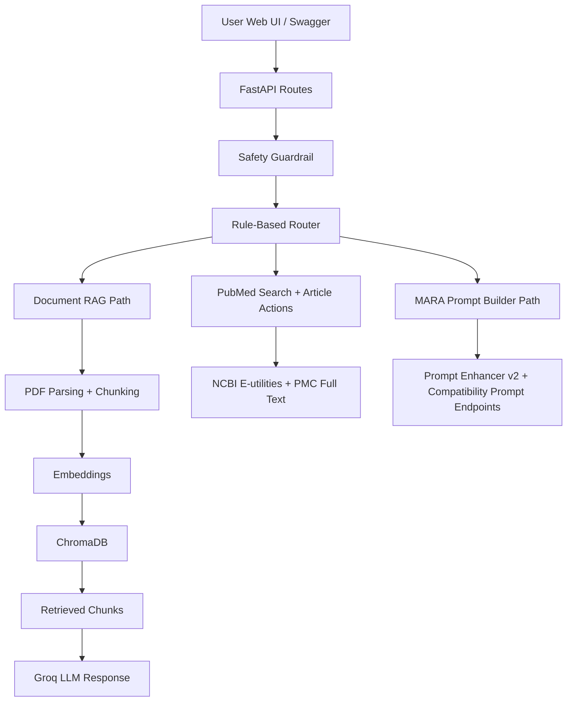

# MARA

MARA, short for **Medical Agent RAG Assistant**, is a FastAPI project for **medical education and document understanding only**. It lets you upload medical PDFs, retrieve grounded answers from them, summarize or simplify the material, generate study quizzes, search PubMed/open literature, compare selected studies, import open articles, and build safe prompt plans through MARA Prompt Builder.

`v2.0` adds a Generative AI upgrade layer: Prompt Enhancer v2 / Context-Harness Lab, refined medical safety levels, RAG v2 retrieval infrastructure, safer Open Article import, and an adapter-based Open Literature Engine while keeping Swagger at `/docs` for developer testing.

## Safety Boundary

- This project is **not** a diagnosis, dosage, triage, or treatment system.
- It must refuse:
  - diagnosis requests
  - medication dosage requests
  - emergency triage requests
  - personalized treatment recommendations
- It is built for learning, demonstrations, and portfolio use.

## What MARA Includes

- FastAPI backend with Swagger docs
- interactive web UI at `/`
- `GET /health`
- `GET /api/documents`
- `POST /api/documents/upload`
- `POST /api/chat/ask`
- `GET /api/prompts/search`
- `GET /api/prompts/{prompt_id}`
- `POST /api/prompts/suggest`
- `POST /api/prompts/improve`
- `POST /api/prompts/enhance-v2`
- `POST /api/pubmed/transform`
- `POST /api/pubmed/import-url`
- `POST /api/open-literature/search`
- `POST /api/open-literature/transform`
- `POST /api/open-article/import`
- `POST /api/open-article/transform`
- PDF validation, parsing, chunking, embeddings, and Chroma persistence
- rule-based routing for `rag`, `summarize`, `simplify`, `quiz`, `pubmed`, and `prompt_enhance`
- safety-first refusal logic
- PubMed metadata search through NCBI E-utilities
- selected PubMed article summarize / simplify / quiz workflows
- multi-study PubMed comparison and merged synthesis
- PMC full-text fallback when a selected PubMed result has a PMCID
- experimental import of readable open-access article URLs
- internal prompt endpoints kept for compatibility, plus the visible MARA Prompt Builder for structured execution plans

## What v2.0 Adds

- structured MARA prompt packages with route, retrieval plan, context plan, safety plan, quality checks, and copyable optimized prompts
- three-level educational medical safety policy with post-generation checking
- configurable RAG strategies: `similarity`, `mmr`, `hybrid`, and `hybrid_rerank`
- duplicate PDF upload detection by SHA-256 hash
- source-aware citation metadata with filename, page, section, and chunk labels where available
- whole-document workflows at `POST /api/documents/workflow`
- reusable Open Article pipeline with extraction status, full-text status, metadata, quality score, and warnings
- Open Literature Engine with source adapters for PubMed/PMC, Europe PMC, OpenAlex, Unpaywall, Crossref, CORE, Semantic Scholar, DOAJ, Cureus policy handling, and generic HTML fallback
- lightweight eval cases and dry-run harness at `scripts/evaluate_rag.py`

The default runtime still works as a portfolio/demo project. Heavy rerankers, LangGraph orchestration, OCR, and stronger embedding models remain optional/configured paths, not mandatory local dependencies.

## What v2.0 Still Does Not Include

- authentication
- deployment
- mandatory OCR for scanned PDFs
- mandatory LangGraph orchestration
- multi-user accounts
- live prompts.chat or MCP dependency
- guaranteed full text for every PubMed article
- publisher-site scraping as a primary workflow

## Interface Map

- Web app: [http://127.0.0.1:8000/](http://127.0.0.1:8000/)
- Swagger: [http://127.0.0.1:8000/docs](http://127.0.0.1:8000/docs)
- Health: [http://127.0.0.1:8000/health](http://127.0.0.1:8000/health)

## Quickstart

### Windows

1. Clone the repo:

```powershell
git clone https://github.com/ahmedMnakbi/MedAgentic-RAG-Assistant.git
cd MedAgentic-RAG-Assistant
```

2. Run the local launcher:

```powershell
python start_local.py
```

If Windows opens the Microsoft Store when you type `python`, use the Python launcher instead:

```powershell
py start_local.py
```

You can also disable the Windows App Execution Alias for `python.exe` in Windows Settings.

3. Open [http://127.0.0.1:8000/](http://127.0.0.1:8000/).

### macOS/Linux

1. Clone the repo:

```bash
git clone https://github.com/ahmedMnakbi/MedAgentic-RAG-Assistant.git
cd MedAgentic-RAG-Assistant
```

2. Run the local launcher:

```bash
python3 start_local.py
```

3. Open [http://127.0.0.1:8000/](http://127.0.0.1:8000/).

The launcher creates `.venv`, installs `requirements.txt`, copies `.env.example` to `.env` when needed, creates local storage folders, and starts FastAPI at `127.0.0.1:8000`.

Useful URLs:

- App: [http://127.0.0.1:8000/](http://127.0.0.1:8000/)
- Swagger: [http://127.0.0.1:8000/docs](http://127.0.0.1:8000/docs)
- Health: [http://127.0.0.1:8000/health](http://127.0.0.1:8000/health)

## High-Level Architecture



## External Services You Need

- Groq: [https://console.groq.com/](https://console.groq.com/)
  - required for RAG answers, summaries, simplification, quizzes, and live prompt improvement
- PubMed: [https://pubmed.ncbi.nlm.nih.gov/](https://pubmed.ncbi.nlm.nih.gov/)
  - required for literature metadata search
- NCBI E-utilities docs: [https://www.ncbi.nlm.nih.gov/books/NBK25497/](https://www.ncbi.nlm.nih.gov/books/NBK25497/)

## Manual Setup

Use this fallback if you do not want to use `start_local.py`.

```bash
python -m venv .venv
# activate venv
pip install -r requirements.txt
cp .env.example .env
uvicorn app.main:app --reload
```

On Windows PowerShell, activation is:

```powershell
.\.venv\Scripts\Activate.ps1
```

Open `.env` and set these when you want live generation/literature features:

- `GROQ_API_KEY`
- `NCBI_EMAIL`
- optionally `NCBI_API_KEY`

Recommended runtime: Python `3.12`. Minimum supported runtime for the launcher is Python `3.11`.

The first PDF upload on a fresh machine can still take longer because the embedding model may download once.

## Troubleshooting

- **Port 8000 already in use:** stop the other process using port 8000, or run manual `uvicorn app.main:app --reload --port 8001`.
- **`python` opens the Microsoft Store on Windows:** run `py start_local.py`, install Python from [python.org](https://www.python.org/downloads/), or disable the Windows App Execution Alias for `python.exe`.
- **Missing API key:** the app still starts without `GROQ_API_KEY`; generation features return a clear configuration error when used. Add your key to `.env` for live LLM answers.
- **PDF upload uses text fallback:** if Chroma/vector indexing fails, MARA can still save readable PDFs as `indexed_text_only` and use direct PDF text fallback for selected-document workflows.
- **Chroma/vectorstore issues:** remove or move local `vectorstore/` only if you intentionally want to rebuild embeddings. Do not delete it if you need existing indexed vectors.

## Main Endpoints

### `GET /health`

- simple server status check

### `GET /api/documents`

- lists uploaded document metadata
- returns:
  - `document_id`
  - `filename`
  - `page_count`
  - `chunk_count`
  - `uploaded_at`

### `POST /api/documents/upload`

- uploads and indexes a PDF
- validates:
  - `.pdf` extension
  - content type when present
  - max file size, defaulting to 100 MB
  - PDF signature
  - corrupted PDF handling
  - empty-text PDF handling

### `POST /api/chat/ask`

Request example:

```json
{
  "question": "Summarize what the uploaded document says about Addison's disease.",
  "mode": "auto",
  "document_ids": null,
  "enhance_prompt": false,
  "top_k": 4
}
```

Possible statuses:

- `ok`
- `refused`
- `no_source`

Rules:

- unsafe medical requests are refused before any retrieval or generation
- if retrieval does not find useful chunks, the assistant says the answer was not found in the uploaded documents

### `GET /api/prompts/search`

- searches the internal prompt library
- supports:
  - `query`
  - `limit`
  - `type`
  - `category`
  - `tag`

### `GET /api/prompts/{prompt_id}`

- returns one prompt template plus its variables

### `POST /api/prompts/improve`

- improves a rough prompt while preserving meaning
- adds structure and output expectations without changing the task
- does not add new medical facts

Example:

```json
{
  "prompt": "summarize a medical topic for students",
  "outputType": "text",
  "outputFormat": "structured_json"
}
```

### `POST /api/prompts/enhance-v2`

- builds a structured MARA execution package from messy input
- returns optimized prompt, inferred mode, retrieval query, context plan, retrieval plan, output contract, safety plan, quality checks, warnings, and sendability
- deterministic fallback works without API keys
- unsafe clinical prompts are transformed into safe educational prompts or blocked when needed

### `POST /api/pubmed/transform`

- takes one or more selected PubMed PMIDs
- tries PMC full text first when available
- falls back to PubMed abstract text
- supports:
  - `summarize`
  - `compare`
  - `simplify`
  - `quiz`

Example:

```json
{
  "pmids": ["39738916"],
  "action": "summarize",
  "question": "Summarize the selected article for medical students.",
  "enhance_prompt": false,
  "prefer_full_text": true
}
```

### `POST /api/pubmed/import-url`

- experimental workflow for importing readable text from a public open-access article URL
- supports the same actions as selected PubMed articles
- blocks localhost/private-network URLs
- may fail on sites that require login, heavy JavaScript, or anti-bot protection

### `POST /api/open-article/import`

- imports one public article URL through the reusable Open Article pipeline
- reports title/source metadata, full-text status, quality score, warnings, and whether the source is allowed for AI processing
- treats Cureus as link-only/restricted by default unless explicitly enabled

### `POST /api/open-article/transform`

- runs educational article actions such as summarize, simplify, quiz, key claims, limitations, PICO, citation card, study notes, exam questions, and methodology extraction
- keeps the same medical safety boundary and post-generation safety check

### `POST /api/open-literature/search`

- searches trusted biomedical/open-access sources broadly and ingests narrowly
- reports query variants, sources searched, candidate counts, full-text/abstract/metadata/restricted counts, selected sources, warnings, and evidence table rows
- labels source status explicitly and never claims full text was used when only abstract or metadata was available

## Web UI Overview

The class-demo interface at `/` has three areas:

- `Document Dock`
  - upload PDFs
  - view indexed documents
- `Assistant Lab`
  - ask questions
  - switch between modes
  - compare `top_k`
  - toggle prompt enhancement
  - select PubMed results for summary, comparison, simplification, or quizzes
  - try experimental open-access URL import
- `MARA Prompt Builder`
  - turn rough medical-learning requests into route/source/retrieval/context/safety plans
  - send clean tasks to Assistant Lab, Open Literature, or Open Article

Swagger remains available for low-level API testing.

## MARA Prompt Builder Design

The visible prompt feature builds structured MARA execution packages. It preserves the user's intent, chooses a route, plans retrieval/context, adds safety and quality checks, and avoids adding medical facts before retrieval. Legacy prompt endpoints remain available for API compatibility.

## Suggested Demo Flow

1. Open the web app at `/`.
2. Show the health pill and the Swagger link.
3. Upload a text-based medical PDF.
4. Ask an unsafe dosage question and show refusal.
5. Ask a grounded study question and show sources.
6. Switch to `summarize`, `simplify`, and `quiz`.
7. Use a PubMed question to show literature metadata.
8. Select multiple PubMed studies and run `compare` or `summarize`.
9. Optionally demonstrate the open-access article URL import.
10. Open `MARA Prompt Builder` and build a safe route/source plan from a rough request.

## Project Structure

```text
app/
  api/routes/              # FastAPI endpoints
  clients/                 # Groq, Chroma, PDF loader, NCBI wrappers
  core/                    # config, constants, exceptions
  prompts/                 # prompt templates for generation
  schemas/                 # request/response models
  services/                # business logic
  web/                     # class-demo web interface
  storage/                 # local runtime storage
  utils/                   # helper utilities
tests/                     # automated tests
start_local.py             # cross-platform local launcher
```

## Testing

Run the automated suite:

```bash
pytest
```

Current local baseline for `v2.0` is tracked by the automated test suite.

## Current Limitations

- educational use only
- no diagnosis or treatment
- no OCR for scanned PDFs
- PubMed article actions are still limited by abstract availability or PMC full text
- open-access URL import is experimental and site-dependent
- no authentication or multi-user support
- no deployment pipeline yet

## Good Next Steps After v2.0

- add true side-by-side comparison tables and evidence-agreement views for selected studies
- add post-generation safety checking
- add richer source citation formatting in the UI
- add Docker for easier classroom demos
- add conversation history or session memory
- add exportable study notes and quiz sets
