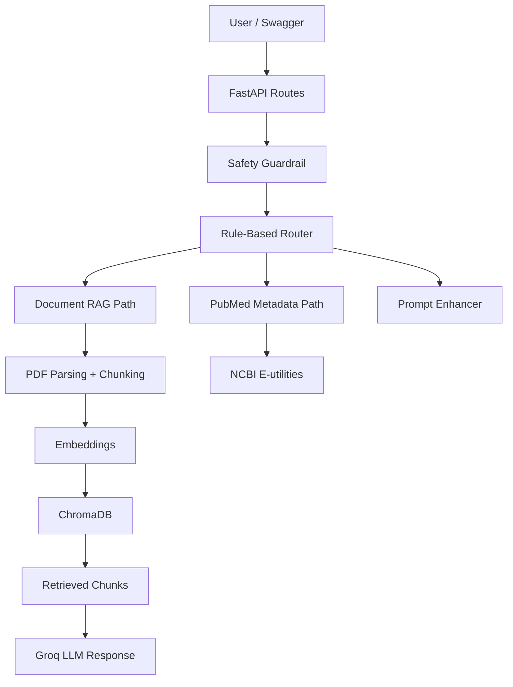

# MedAgentic RAG Assistant

MedAgentic RAG Assistant is a FastAPI backend for **medical education and document understanding only**. It uses uploaded medical PDFs, retrieval, and tool-style routes to support source-grounded Q&A, summarization, simplification, quiz generation, prompt enhancement, and PubMed metadata lookup.

It is designed as an **API-first student portfolio project** with a clear safety boundary, simple architecture, Swagger-based testing, and realistic educational use cases.

## What The Project Does

- upload medical PDFs
- extract and chunk the text
- create embeddings with `all-MiniLM-L6-v2`
- store vectors in ChromaDB
- answer questions from uploaded documents
- summarize, simplify, and generate quiz questions
- search PubMed metadata through NCBI E-utilities
- refuse unsafe clinical requests

## Demo Value

This repository is a good portfolio/demo project because it shows:

- FastAPI backend design
- modular service architecture
- retrieval-augmented generation
- vector database usage
- external API integration
- prompt design
- medical safety boundaries
- test coverage for core behaviors

## Safety Boundary

- This project is **not** a diagnosis, triage, or treatment tool.
- It must refuse:
  - diagnosis requests
  - medication dosage requests
  - emergency triage requests
  - personalized treatment recommendations
- It is intended for study demos, portfolio use, and educational document analysis.

## v1 Features

- FastAPI backend with Swagger docs
- `GET /health`
- `GET /api/documents`
- `POST /api/documents/upload`
- `POST /api/chat/ask`
- PDF validation, parsing, chunking, embeddings, and Chroma persistence
- Rule-based router for `rag`, `summarize`, `simplify`, `quiz`, `pubmed`, and `prompt_enhance`
- Safety-first refusal logic
- PubMed metadata search via NCBI E-utilities

## High-Level Architecture



## Main Endpoints

- `GET /health`
  - quick server status check
- `GET /api/documents`
  - list uploaded documents and metadata
- `POST /api/documents/upload`
  - upload and index a text-based PDF
- `POST /api/chat/ask`
  - ask a question or choose a specific mode

## Excluded From v1

- frontend
- authentication
- deployment
- LangGraph orchestration
- OCR for scanned PDFs
- multi-user features
- prompts.chat or MCP live integration

## Environment

Create a `.env` file from `.env.example` and set:

- `GROQ_API_KEY`
- `GROQ_MODEL`
- `NCBI_EMAIL`
- optionally `NCBI_API_KEY`

Recommended: Python 3.12 for the smoothest local experience with the RAG stack.

External services used in v0.5:

- Groq console: [https://console.groq.com/](https://console.groq.com/)
- PubMed: [https://pubmed.ncbi.nlm.nih.gov/](https://pubmed.ncbi.nlm.nih.gov/)
- NCBI E-utilities docs: [https://www.ncbi.nlm.nih.gov/books/NBK25497/](https://www.ncbi.nlm.nih.gov/books/NBK25497/)

## Run From GitHub Step By Step

1. Clone the repository:

```bash
git clone https://github.com/ahmedMnakbi/MedAgentic-RAG-Assistant.git
cd MedAgentic-RAG-Assistant
```

2. Create a virtual environment:

```bash
python -m venv .venv
```

3. Activate it on Windows PowerShell:

```bash
.\.venv\Scripts\Activate.ps1
```

4. Install dependencies:

```bash
pip install -r requirements.txt
```

5. Create your local env file:

```bash
Copy-Item .env.example .env
```

6. Open `.env` and add:

- `GROQ_API_KEY`
- `GROQ_MODEL`
- `NCBI_EMAIL`
- optionally `NCBI_API_KEY`

7. Start the API:

```bash
uvicorn app.main:app --reload
```

8. Open:

- Swagger UI: [http://127.0.0.1:8000/docs](http://127.0.0.1:8000/docs)
- Health check: [http://127.0.0.1:8000/health](http://127.0.0.1:8000/health)

## Suggested First Demo Flow

1. Open Swagger.
2. Run `GET /health` and show `{"status": "ok"}`.
3. Run `POST /api/chat/ask` with an unsafe dosage request and show refusal.
4. Upload a text-based medical PDF.
5. Run `GET /api/documents` and show the stored metadata.
6. Ask a document-grounded question in `rag` mode.
7. Ask for a summary in `summarize` mode.
8. Ask for quiz questions in `quiz` mode.
9. Run a `pubmed` query and show metadata-only results.

## API Notes

### `POST /api/documents/upload`

- accepts PDF files only
- validates extension, content type when present, size, and PDF signature
- rejects corrupted PDFs and PDFs without extractable text

### `GET /api/documents`

- lists uploaded document metadata

### `POST /api/chat/ask`

Request example:

```json
{
  "question": "Summarize the key points about heart failure from the uploaded document.",
  "mode": "auto",
  "document_ids": null,
  "enhance_prompt": false,
  "top_k": 4
}
```

Possible response statuses:

- `ok`
- `refused`
- `no_source`

No-source behavior:

- if retrieval does not find a useful match, the assistant says the answer was not found in the uploaded documents

Example unsafe request:

```json
{
  "question": "How many mg of ibuprofen should I take?"
}
```

Expected result:

- `status = "refused"`
- educational-only refusal message

## Project Structure

```text
app/
  api/routes/              # FastAPI endpoints
  clients/                 # Wrappers for Groq, Chroma, PDF loader, NCBI
  core/                    # config, constants, exceptions
  prompts/                 # system prompt templates
  schemas/                 # request/response models
  services/                # business logic
  storage/                 # local runtime storage
  utils/                   # helper utilities
tests/                     # automated tests
```

## Limitations In v0.5

- educational use only
- no diagnosis or triage
- no medication dosage guidance
- no authentication
- no frontend
- no OCR for scanned PDFs
- no deployment pipeline
- PubMed is metadata-only in this version

## Suggested Next Improvements

- add post-generation safety checks
- add abstract snippets for PubMed v1.1
- improve router heuristics with fallback classification
- support better source citation formatting
- add Docker support
- add a lightweight frontend later

## Testing

```bash
pytest
```

## PubMed v1 Scope

PubMed integration is metadata-only in v1:

- PMID
- title
- authors
- journal
- publication date
- PubMed URL

Abstract snippets and synthesis are intentionally deferred to v1.1.
